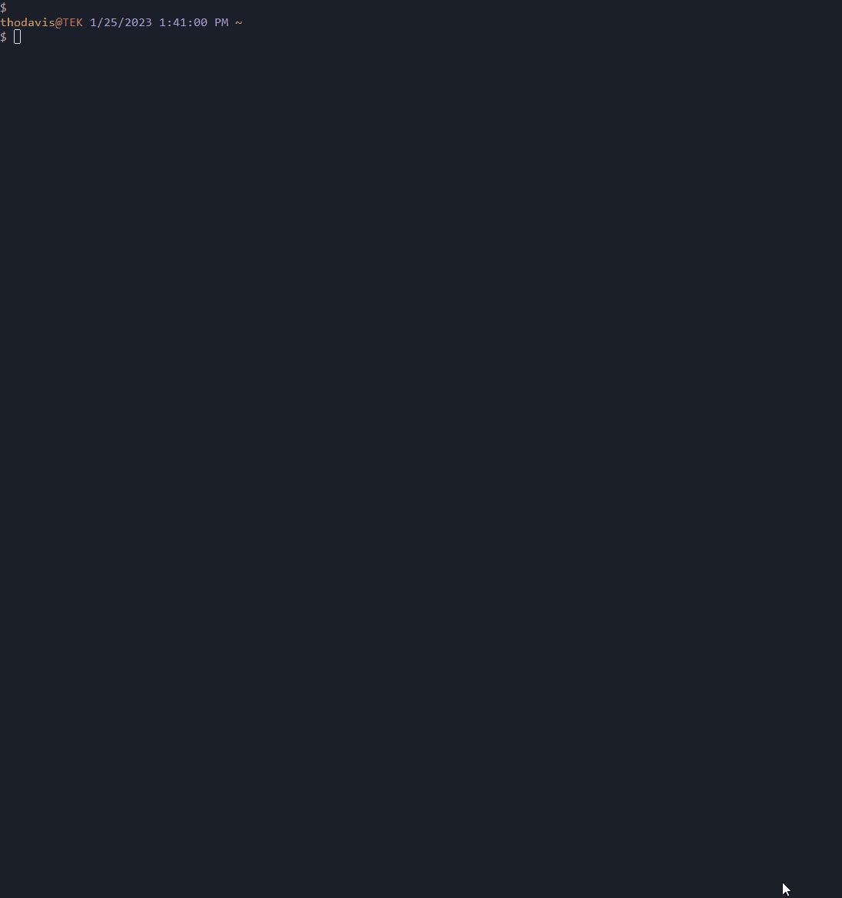

# Start Real World Environment

Function: `Start-RWEnvironment`
| Alias: `rwp`

Helpful for starting a developer environment that utilizes microservices. Creates grouped console tabs for each project section and automatically starts required servers. To maximize efficiency, it's best to only use the GENERAL tab for directory navigation, as each new console has an intended purpose.

The top console for each section is intended for running integration tests. Use commands `gcd`, `gcdb`, etc. The middle console is ideal for running unit tests and will only exist if a "tests" folder is detected. The bottom console is for running/restarting servers and will only exist if a local server is required. The top and middle consoles are also great for opening editors with `ij .` and `code .` respectively.

You can navigate between console tab groups using `ctrl + tab` and navigate between consoles in a group using `alt + up` and `alt + down`

This module makes the following assumptions:

1. You're in the root directory of the project you want to start.
2. All services are started using the same command. By default, it assumes `npm start` but can be edited to suit other tools
3. Your project follows a particular structure

-   root/application/app1, root/application/app2, etc.
-   root/service/service1, root/service/service2, etc.

